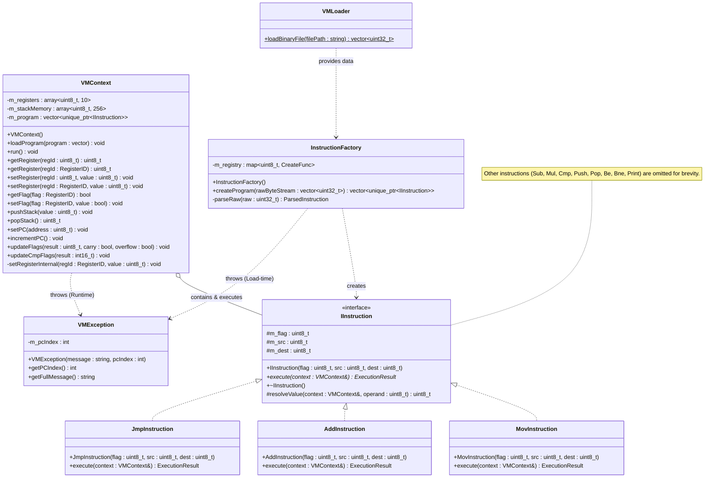

# System Architecture & Technical Design

## 1. Introduction

The **Virtual Machine Simulator** is a custom runtime environment designed to execute a defined set of bytecode instructions. This project implements a virtual machine architecture, encompassing an instruction set, memory management, and an execution cycle. The system includes a Python-based assembler that translates human-readable assembly language into the binary format executable by the VM.

## 2. System Overview

The system workflow consists of two primary stages: **Assembly** and **Execution**.

1. **Assembly Phase**: The Python assembler (`encode.py`) processes source files containing assembly instructions. It parses each line, validates syntax, and encodes instructions into a 32-bit binary format, generating a `.bin` output file.
2. **Execution Phase**: The C++ Virtual Machine loads the binary file. The `VMLoader` reads the raw byte stream, which the `InstructionFactory` decodes into executable instruction objects. The `VMContext` manages the execution lifecycle, maintaining the state of registers and memory.

## 3. Core Components

The architecture comprises several core components that interact to simulate a computer system.

### 3.1. VMContext (Execution Environment)

The `VMContext` class functions as the central processing unit and state manager. It encapsulates:

- **Registers**: General-purpose and special-purpose registers.
- **Stack Memory**: A fixed-size memory segment for stack operations.
- **Program Memory**: The sequence of instructions to be executed.
- **Program Counter (PC)**: Tracks the current instruction index.

### 3.2. InstructionFactory (Decoder)

The `InstructionFactory` manages the **Decode** phase. It transforms raw 32-bit integers from the binary file into specific `IInstruction` objects (e.g., `AddInstruction`, `MovInstruction`). The factory utilizes a registry of creation functions mapped to opcodes, ensuring an extensible design.

### 3.3. IInstruction (Instruction Interface)

The `IInstruction` interface defines the contract for all executable instructions. It implements the **Strategy Pattern**, enabling the VM to execute instructions polymorphically via the `execute()` method, abstracting specific implementation details.

## 4. Execution Model

The VM adheres to a simplified **Fetch-Decode-Execute** cycle:

1. **Load**: The `VMLoader` loads the binary file content into memory.
2. **Decode**: The `InstructionFactory` instantiates instruction objects from the raw data.
3. **Execution Loop**:
   - **Fetch**: The VM retrieves the instruction at the current Program Counter (PC).
   - **Execute**: The instruction's `execute()` method is invoked with the current `VMContext`.
   - **Update**: The PC is incremented or modified (in case of jumps), and the cycle repeats.

### Memory Layout

- **Registers**: 10 internal registers (R0-R2, PC, SP, BP, Flags).
- **Stack**: A 256-byte array used for `PUSH` and `POP` operations. The Stack Pointer (SP) grows downwards.

## 5. Instruction Set Architecture (ISA)

### 5.1. Binary Instruction Format

Each instruction is encoded into a fixed **32-bit (4-byte)** format:

| Byte 0 (MSB) | Byte 1 | Byte 2 | Byte 3 (LSB) |
| :---: | :---: | :---: | :---: |
| `Opcode (6 bits)` \| `Flag (2 bits)` | `Reserved (8 bits)` | `Source Operand (8 bits)` | `Destination Operand (8 bits)` |

- **Opcode**: Identifies the operation (e.g., ADD, MOV).
- **Flag**: Specifies the addressing mode (e.g., Register-to-Register, Immediate-to-Register).
- **Source/Dest**: Register IDs or Immediate values.

### 5.2. Supported Instructions

| Opcode | Mnemonic | Description | Usage Example |
| :---: | :--- | :--- | :--- |
| `0x01` | **MOV** | Move data to a register | `MOV R0, 10` |
| `0x02` | **ADD** | Add source to destination | `ADD R0, R1` |
| `0x03` | **SUB** | Subtract source from destination | `SUB R0, 5` |
| `0x04` | **MUL** | Multiply source and destination | `MUL R1, R2` |
| `0x05` | **CMP** | Compare two values (sets flags) | `CMP R0, 10` |
| `0x06` | **PUSH** | Push value onto the stack | `PUSH R0` |
| `0x07` | **POP** | Pop value from stack to register | `POP R1` |
| `0x08` | **JMP** | Unconditional jump to address | `JMP 5` |
| `0x09` | **BE** | Branch if Equal (ZF=1) | `BE 10` |
| `0x0A` | **BNE** | Branch if Not Equal (ZF=0) | `BNE 10` |
| `0x0B` | **PRINT** | Output register value to console | `PRINT R0` |

### 5.3. Registers

| Register | ID | Description |
| :---: | :---: | :--- |
| **R0 - R2** | `0x01 - 0x03` | General Purpose Registers |
| **PC** | `0x04` | Program Counter |
| **SP** | `0x05` | Stack Pointer |
| **BP** | `0x06` | Base Pointer |
| **ZF** | `0x07` | Zero Flag (Set if result is 0) |
| **CF** | `0x08` | Carry Flag |
| **OF** | `0x09` | Overflow Flag |

## 6. Design Patterns

The system architecture incorporates established software design patterns to ensure code quality and maintainability.

### 6.1. Strategy Pattern

- **Implementation**: The `IInstruction` interface acts as the strategy interface, and concrete classes like `AddInstruction` and `MovInstruction` are concrete strategies.
- **Benefit**: Decouples the execution logic from the VM loop. New instructions can be added by simply creating a new class without modifying the core execution engine.

### 6.2. Factory Pattern

- **Implementation**: The `InstructionFactory` encapsulates the object creation logic. It uses a map to associate opcodes with creation functions.
- **Benefit**: Adheres to the Open/Closed Principle. Adding a new instruction requires registering it in the factory, without altering the parsing logic.

### 6.3. Command Pattern

- **Implementation**: Each instruction object encapsulates all the information (operands, flags) required to execute an action.
- **Benefit**: Instructions are treated as first-class objects that can be stored in a list (`m_program`) and executed sequentially or non-sequentially.

### 6.4. Singleton-like Context

- **Implementation**: The `VMContext` is passed to every instruction during execution.
- **Benefit**: Provides a shared, consistent state for all operations while avoiding global variables.

## 7. Class Diagram

The following diagram illustrates the static structure of the system and the relationships between classes.



## 8. Project Directory Structure

```
oop-cnu-term-project/
├── include/                    # Header files
│   ├── Enums.h                # Enumerations for opcodes, registers, and flags
│   ├── core/                  # Core VM components
│   │   ├── IInstruction.h     # Abstract instruction interface
│   │   ├── InstructionFactory.h  # Factory for creating instructions
│   │   ├── VMContext.h        # VM execution context
│   │   ├── VMException.h      # VM exception class
│   │   └── VmLoader.h         # Binary file loader
│   └── instructions/          # Concrete instruction implementations
├── src/                       # Implementation files
│   ├── main.cpp              # Entry point
│   ├── core/                 # Core implementations
│   └── instructions/         # Instruction implementations
├── test/                      # Test files and tools
│   ├── encode.py             # Python assembler
│   ├── run_tests.py          # Automated test runner
│   ├── text/                 # Assembly source files (.txt)
│   ├── bin/                  # Compiled binary files (.bin)
│   └── answer/               # Expected outputs
├── docs/                      # Project documentation
└── CMakeLists.txt            # CMake build configuration
```
